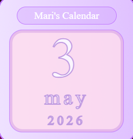
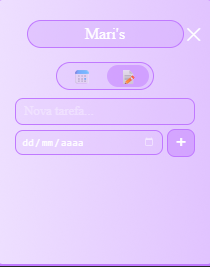

# Mari's Calendar 🗓️

A cute desktop widget built with Electron that displays the current date and a to-do list with deadline tracking.

## Features

- **Calendar tab** — shows the current day, month and year
- **To-Do tab** — add, remove and check off tasks, with optional deadlines
- **Deadline alert** — on the due date, the calendar shows a warning: *"Dia final de {task name}"*
- **Always on top** — floats over all other windows like a desktop widget
- **Persistent data** — tasks are saved locally and survive app restarts

## Preview

| Calendar | To-Do |
|----------|-------|
|  |  |

## Getting Started

### Prerequisites

- [Node.js](https://nodejs.org/) (v18 or higher)

### Install & Run

```bash
npm install
npm start
```

### Build (Windows installer)

```bash
npm run dist
```

The installer will be generated in the `dist/` folder. After installing, you can add the app to Windows startup by placing its shortcut in:

```
shell:startup
```

## Tech Stack

- [Electron](https://www.electronjs.org/)
- [electron-builder](https://www.electron.build/)
- Vanilla JS + CSS
- localStorage for data persistence

## Project Structure

```
├── main.js        # Electron main process
├── preload.js     # Context bridge (IPC)
├── index.html     # App layout
├── script.js      # Renderer logic (calendar, to-do, tabs)
├── style.css      # Styles
└── assets/        # Background images and icons
```
